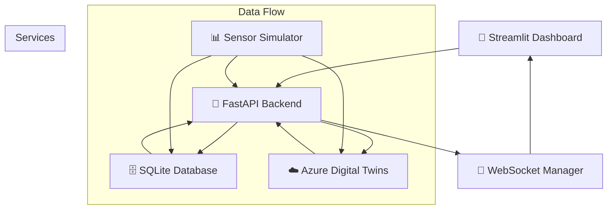

# 🏭 Digital Twin Sample Application

A comprehensive Digital Twin solution using Python, Azure Digital Twins SDK, FastAPI, and Streamlit that demonstrates real-time factory machine monitoring and control.

## ✨ Features

### 🔧 Core Capabilities
- **Factory Machine Modeling**: Complete digital twin representation using Azure Digital Twins SDK
- **IoT Sensor Simulation**: Realistic temperature, humidity, and vibration sensor data generation
- **Real-time Data Storage**: SQLite database with efficient sensor data management and history
- **REST API**: FastAPI backend with comprehensive endpoints for twin management
- **Interactive Dashboard**: Modern Streamlit frontend with real-time visualization and controls
- **WebSocket Support**: Real-time bidirectional communication between components
- **Azure Integration**: Full Azure Digital Twins integration with fallback mock mode

### 🎛️ Dashboard Features
- **Real-time Monitoring**: Live sensor readings with automatic refresh
- **Interactive Controls**: Start/stop machines, adjust thresholds, reset alarms
- **Modern UI Design**: Card-based layout with responsive design
- **Alert Management**: Visual alerts with threshold-based notifications
- **Data Visualization**: Charts, gauges, and trend analysis (when libraries available)
- **System Overview**: Machine status summary and health indicators

### 🔄 Real-time Synchronization
- **Bidirectional Sync**: Changes in UI instantly reflect in Azure Digital Twins
- **WebSocket Updates**: Live data streaming without page refresh
- **Multi-user Support**: Multiple dashboard users can monitor simultaneously
- **Event Streaming**: Real-time alerts and status change notifications

## 🏗️ Architecture



## 📁 Project Structure

```
azuredigitaltwins/
├── 📄 main.py                    # Application entry point
├── 📋 requirements.txt           # Python dependencies
├── 🔧 .env.example              # Environment configuration template
├── 
├── ⚙️ config/                    # Configuration management
│   ├── __init__.py
│   └── settings.py              # Pydantic settings with environment variables
├── 
├── 🏗️ models/                    # Data models and schemas
│   ├── __init__.py
│   ├── dtdl_models.py           # Digital Twin Definition Language models
│   └── data_models.py           # Pydantic API models
├── 
├── 🔧 services/                  # Core business logic services
│   ├── __init__.py
│   ├── sqlite_service.py        # Database operations
│   ├── azure_dt_service.py      # Azure Digital Twins integration
│   ├── sensor_simulator.py      # IoT sensor data simulation
│   └── websocket_service.py     # Real-time WebSocket management
├── 
├── 🚀 api/                       # FastAPI backend
│   ├── __init__.py
│   ├── main.py                  # FastAPI application
│   └── routes/                  # API endpoints
│       ├── __init__.py
│       ├── twins.py             # Digital twin management
│       └── sensors.py           # Sensor data endpoints
├── 
├── 🎨 frontend/                  # Streamlit dashboard
│   ├── __init__.py
│   ├── main.py                  # Main dashboard application
│   ├── components/              # Reusable UI components
│   │   └── __init__.py
│   └── styles/                  # CSS and styling
│       └── __init__.py
├── 
├── 🧪 tests/                     # Unit tests
│   ├── __init__.py
│   ├── test_sqlite_service.py
│   ├── test_azure_dt_service.py
│   └── test_sensor_simulator.py
└── 
└── 📚 docs/                      # Documentation
    ├── __init__.py
    ├── setup.md                 # Installation and setup guide
    ├── user_guide.md            # Dashboard user guide
    └── api_reference.md         # Complete API documentation
```

## 🚀 Quick Start

### Prerequisites
- Python 3.8+
- pip package manager
- (Optional) Azure subscription with Digital Twins instance

### 1️⃣ Installation
```bash
git clone <repository-url>
cd azuredigitaltwins
pip install -r requirements.txt
```

### 2️⃣ Configuration
```bash
cp .env.example .env
# Edit .env with your settings (Azure credentials optional)
```

### 3️⃣ Setup
```bash
python main.py setup
```

### 4️⃣ Run the Application
```bash
# Terminal 1: Start API server
python main.py api

# Terminal 2: Start dashboard
python main.py frontend

# Terminal 3: Start sensor simulation (optional)
python main.py simulate
```

### 5️⃣ Access the Dashboard
- **Dashboard**: http://localhost:8501
- **API Documentation**: http://localhost:8000/docs
- **Health Check**: http://localhost:8000/api/health

## 📊 Dashboard Screenshots

*Dashboard interface with modern card-based design, real-time metrics, and interactive controls for factory machine monitoring.*

## 🔧 Key Components

### Digital Twin Service (`services/azure_dt_service.py`)
- Azure Digital Twins SDK integration
- DTDL model management
- Mock mode for development without Azure
- Real-time telemetry and property updates

### Sensor Simulator (`services/sensor_simulator.py`)
- Realistic sensor data generation with patterns
- Machine type-specific behavior simulation
- Alert condition simulation
- Configurable thresholds and update intervals

### Database Service (`services/sqlite_service.py`)
- SQLite integration with async support
- Sensor data history management
- Machine state persistence
- Event logging and cleanup

### FastAPI Backend (`api/main.py`)
- RESTful API with automatic documentation
- WebSocket support for real-time updates
- Health monitoring and status endpoints
- CORS support for web integration

### Streamlit Dashboard (`frontend/main.py`)
- Modern, responsive web interface
- Real-time data visualization
- Interactive machine controls
- Alert management and system monitoring

## 🎯 Use Cases

### Factory Monitoring
- Real-time oversight of production equipment
- Predictive maintenance through sensor trend analysis
- Automated alert systems for equipment anomalies
- Historical data analysis for optimization

### Digital Twin Development
- Reference implementation for Azure Digital Twins
- Template for IoT sensor integration
- WebSocket-based real-time synchronization
- Modern web dashboard patterns

### Education and Training
- Comprehensive example of full-stack IoT application
- Demonstrates best practices in Python development
- Shows integration patterns for cloud services
- Includes testing and documentation examples

## 🧪 Testing

```bash
# Run all tests
python -m pytest tests/ -v

# Run specific test files
python -m pytest tests/test_sqlite_service.py -v
python -m pytest tests/test_azure_dt_service.py -v
python -m pytest tests/test_sensor_simulator.py -v

# Run with coverage
pip install pytest-cov
python -m pytest tests/ --cov=. --cov-report=html
```

## 📚 Documentation

- **[Setup Guide](docs/setup.md)**: Complete installation and configuration instructions
- **[User Guide](docs/user_guide.md)**: How to use the dashboard and features
- **[API Reference](docs/api_reference.md)**: Complete API documentation with examples

## 🛠️ Development

### Code Style
```bash
pip install black flake8
black . --line-length 100
flake8 . --max-line-length=100
```

### Environment Variables
Key configuration options in `.env`:
```env
# Azure Digital Twins (optional)
AZURE_DT_URL=https://your-instance.api.wcus.digitaltwins.azure.net
AZURE_CLIENT_ID=your-client-id
AZURE_CLIENT_SECRET=your-client-secret
AZURE_TENANT_ID=your-tenant-id

# API Configuration
API_HOST=0.0.0.0
API_PORT=8000

# Dashboard Configuration
STREAMLIT_HOST=0.0.0.0
STREAMLIT_PORT=8501

# Sensor Simulation
SENSOR_UPDATE_INTERVAL=5
TEMPERATURE_MIN=18.0
TEMPERATURE_MAX=35.0
```

## 🔄 Real-time Features

### WebSocket Communication
- Live machine status updates
- Real-time sensor readings
- Instant alert notifications
- Bidirectional command execution

### Data Synchronization
- UI changes immediately sync to Azure Digital Twins
- Sensor updates appear across all connected clients
- Command execution with real-time feedback
- Multi-user collaboration support

## 🎨 Modern UI Design

### Design Principles
- **Card-based Layout**: Clean, organized information display
- **Responsive Design**: Works on desktop, tablet, and mobile
- **Real-time Updates**: Live data without page refresh
- **Interactive Controls**: Intuitive machine operation
- **Visual Alerts**: Clear indication of system status

### Color Coding
- 🟢 **Green**: Normal operation, healthy status
- 🔴 **Red**: Stopped machines, critical alerts
- 🟡 **Yellow**: Warnings, maintenance mode
- 🔵 **Blue**: Information, system status

## 📈 Performance Features

### Optimization
- Efficient database queries with indexes
- Async operations throughout the stack
- Connection pooling and management
- Configurable refresh intervals

### Scalability
- Stateless API design
- WebSocket connection management
- Database cleanup and maintenance
- Resource monitoring and health checks

## 🔒 Security Considerations

### Current Implementation
- No authentication (development focus)
- CORS enabled for local development
- Environment variable configuration
- Input validation with Pydantic

### Production Recommendations
- Implement authentication (JWT, OAuth)
- HTTPS enforcement
- Rate limiting
- Input sanitization
- Azure AD integration

## 🤝 Contributing

This is a sample application demonstrating Digital Twin patterns. Key areas for enhancement:

1. **Authentication & Authorization**
2. **Advanced Data Visualization**
3. **Machine Learning Integration**
4. **Extended Azure Services**
5. **Mobile Application**
6. **Advanced Testing**

## 📄 License

This project is a sample application for educational and demonstration purposes.

## 🆘 Support

For issues or questions:
1. Check the [Setup Guide](docs/setup.md) for installation help
2. Review the [User Guide](docs/user_guide.md) for usage instructions
3. Consult the [API Reference](docs/api_reference.md) for technical details
4. Check the test files for usage examples

## 🙏 Acknowledgments

Built with:
- **FastAPI** - Modern, fast web framework for building APIs
- **Streamlit** - Open-source app framework for ML and data science
- **Azure Digital Twins** - IoT digital twin platform
- **SQLite** - Embedded relational database
- **Plotly** - Interactive graphing library
- **Pydantic** - Data validation and settings management